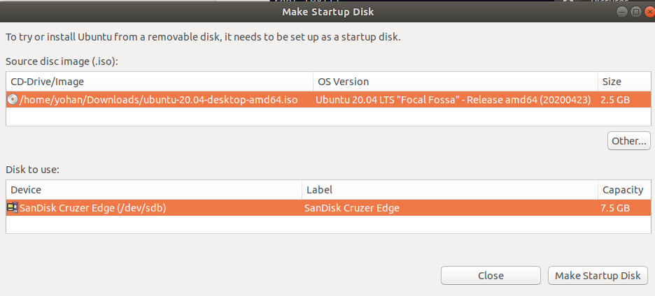
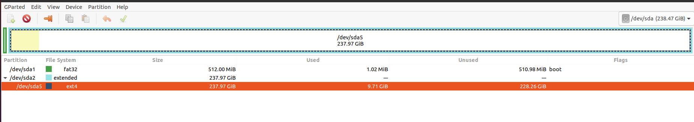
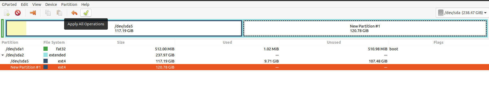

Ubuntu
===================================================================================================

.. contents:: Daftar Isi

Getting Started
---------------------------------------------------------------------------------------------------

Partisi Harddisk
***************************************************************************************************

-  `Membuat partisi di Ubuntu`_

Git
***************************************************************************************************

-  Command:

::

       $ sudo apt update
       $ sudo apt install git
       $ git --version

-  `Install`_
-  `SSH`_

Latex
***************************************************************************************************

-  `Install MiKTeX`_

Pandoc
***************************************************************************************************

-  Install

   -  `download installer`_
   -  Command:

   ::

        $ sudo dpkg -i $DEB

-  $DEB adalah path ke instalasi file (deb)
-  `Referensi`_

Python
***************************************************************************************************

-  Sudah terinstall secara default
-  Cek di terminal: python3 –version

Inkscape
***************************************************************************************************

-  Go to the “Ubuntu Software”

Make
***************************************************************************************************

-  Command:

::

       sudo apt-get install build-essential

-  `Referensi <https://askubuntu.com/questions/161104/how-do-i-install-make>`__

Markdown Editor (ReText)
***************************************************************************************************

-  Command: sudo apt install -y retext
-  `Referensi <https://www.hiroom2.com/2017/05/16/ubuntu-16-04-write-markdown-with-retext/>`__

.. _latex-1:

Latex
***************************************************************************************************

-  `Texlive`_

::

       $ sudo apt-get install texlive-full

-  `Texstudio`_

::

       $ sudo apt-add-repository ppa:blahota/texstudio
       $ sudo apt-get update
       $ sudo apt-get install texstudio

Networking
***************************************************************************************************

-  `Install Samba`_

::

       $ sudo apt update
       $ sudo apt install samba

-  Setting IP-Address: 192.168.0.2 & Netmask: 255.255.255.0
-  Akses komputer dalam network: smb://IP-Address/
-  `Referensi: Share a folder in ubuntu`_
-  `Referensi: Setting LAN in ubuntu`_

Google Chrome
***************************************************************************************************

-  Google Chrome tidak tersedia di Ubuntu Software
-  `Install Google Chrome`_

::

       $ wget https://dl.google.com/linux/direct/google-chrome-stable_current_amd64.deb
       $ sudo dpkg -i google-chrome-stable_current_amd64.deb

Terminal PDF
***************************************************************************************************

-  `merge pdf: pdfunite`_
-  Example: pdfunite sample1.pdf sample2.pdf sample.pdf
-  `extract pdf: qpdf`_
-  `pdftk`_

.. _Membuat partisi di Ubuntu: https://itsfoss.com/gparted/
.. _Install: https://www.digitalocean.com/community/tutorials/how-to-install-git-on-ubuntu-18-04
.. _SSH: https://wiki.paparazziuav.org/wiki/Github_manual_for_Ubuntu
.. _Install MiKTeX: https://miktex.org/howto/install-miktex-unx
.. _download installer: https://github.com/jgm/pandoc/releases/tag/2.9.2.1
.. _Referensi: https://pandoc.org/installing.html
.. _Texlive: https://www.tecrobust.com/insta-latex-ubuntu-texmaker-linux-ubuntu-latest/
.. _Texstudio: http://linuxpitstop.com/install-texstudio-on-ubuntu-linux-15-04/
.. _Install Samba: https://ubuntu.com/tutorials/install-and-configure-samba#2-installing-samba
.. _`Referensi: Share a folder in ubuntu`: http://ubuntuhandbook.org/index.php/2019/11/share-folder-ubuntu-18-04-step-by-step-guide/
.. _`Referensi: Setting LAN in ubuntu`: https://linuxconfig.org/how-to-configure-static-ip-address-on-ubuntu-18-04-bionic-beaver-linux
.. _Install Google Chrome: https://itsfoss.com/install-chrome-ubuntu/
.. _`merge pdf: pdfunite`: http://manpages.ubuntu.com/manpages/bionic/man1/pdfunite.1.html
.. _`extract pdf: qpdf`: http://qpdf.sourceforge.net/
.. _pdftk: https://www.pdflabs.com/docs/pdftk-cli-examples/

Tree
***************************************************************************************************

*Directory tree* bisa diprint di terminal dengan tree command. Command tersebut adalah built-in
di Windows. Sedangkan di ubuntu harus diinstall terlebih dahulu:

::

        sudo apt-get install tree

Selanjutnya bisa digunakan dengan mengetikkan tree command sebagai berikut:

::

        tree

Hasilnya:

.. image:: images/tree.png

Hieararki Filesystem
--------------------------------------------------------------------------------------------------

Sistem folder di ubuntu dan deskripsinya:

========================== ======================================================================
Direktori                    Deskripsi
========================== ======================================================================
/                            root directory
/bin                         command binaries misalnya: cat, ls, cp
/boot                        boot loader
/dev                         device files, misalnya /dev/null, /dev/sda1
/etc                         file konfigurasi
/home                        home direktori
/lib                         library untuk /bin dan /sbin
/media                       mount point untuk removable media (usb drive)
/mnt                         mounting drive 
/proc                        vitual filesystem
/root                        home directory untuk root user
/run                         run-time variable data
/sbin                        system binaries, misalnya fsck, init, route
/srv                         - 
/tmp                         temporary space
/usr                         programs, libraries, dan dokumentasi
/var                         tempat penyimpanan untuk semua variable files 
========================== ======================================================================

**Referensi**

- `Wikipedia - Fileystem Hierarchy Standard`_
- `Tldp - General Overview of The Linux File System`

.. _Wikipedia - Fileystem Hierarchy Standard: https://en.wikipedia.org/wiki/Filesystem_Hierarchy_Standard
.. _Tldp - General Overview of The Linux File System: https://tldp.org/LDP/intro-linux/html/sect_03_01.html 

Bootable Flash Drive 
--------------------------------------------------------------------------------------------------

Berikut ini adalah langkah-langkah untuk membuat bootable usb. Bootable
usb ini diperuntukkan untuk menginstall sebuah operating system (OS)
misalnya ubuntu dan windows melalui usb.

-  Colokkan flaskdisk (usb drive) ke usb port di komputer.
-  Buka **Startup Disk Creator**.
-  Klik other untuk memilih ISO file.
-  Pilih flaskdisk dan kemudian klik **Make Startup Disk**.

|image0|

**Referensi**

-  `Bootable flash drive for ubuntu`_

.. _Bootable flash drive for ubuntu: https://askubuntu.com/questions/876058/bootable-flash-drive-for-ubuntu

Partisi Hardisk
--------------------------------------------------------------------------------------------------

Partisi hardisk di Ubuntu tidak bisa dilakukan ketika Ubuntu sedang
dioperasikan. Partisi dapat dilakukan dengan cara menjalankan instalasi
ubuntu dari usb kemudian pilih **live ubuntu**. Selanjutnya, partisi
dapat dilakukan dengan program yang bernama Gparted.

Contoh hardisk sebelum partisi adalah:

Dengan memilih menu **Partition**, maka hasil partisinya adalah sbb:

Install Printer
--------------------------------------------------------------------------------------------------

Printer canon diinstall di ubuntu dengan cara sebagai berikut:

-  Tambahkan repositori

::

   sudo add-apt-repository ppa:michael-gruz/canon
   sudo apt-get update

-  Install printer sesuai dengan versinya. Contohnya adalah printer MP540.

::

   sudo apt-get install cnijfilter-mp540series

**Referensi**

-  `Askubuntu: Canon Printer`_

.. _`Askubuntu: Canon Printer`: https://askubuntu.com/questions/75014/how-can-i-install-a-canon-printer-or-scanner-driver

Basic Command
--------------------------------------------------------------------------------------------------

Berikut ini adalah basic command ubuntu yang sering saya gunakan:

================================== =======================================================
Task                                Command
================================== =======================================================
update ubuntu package               sudo apt-get update
install package                     sudo apt-get install <Package>
menggunakan super user              sudo su
open terminal                       CTRL + ALT + T
membuat file baru                   touch filenamedotextension (contoh touch README.md)
membuat folder baru                 mkdir namafolder
berpindah ke subfolder              cd namafolder
memindah sebuah file                mv asalFile tujuanFile
exit dari terminal                  exit
rename file                         mv file.ext1 file.ext2
install deb packages                sudo dpkg -i filenamedotdeb
berpindah ke path sebelumnya        cd ..
menampilkan isi file                cp filenamedotextension
menampilkan isi direktori           ls atau ls -a (memunculkan hidden files)
delete file                         rm filenamedotextension
delete semua dengan nama tertentu   rm \*filename*
open file dengan default program    start filenamedotextension
clear terminal                      clear atau CTRL + L
================================== =======================================================

Akses Network Drive
--------------------------------------------------------------------------------------------------

Ada 2 metode untuk akses network drive di ubuntu.

1. GUI (file explorer)

   -  Install samba
   -  Other Locations >> Connect to Server >> Enter server address
   -  Server address format= smb://ip-address

2. Terminal

   -  Install smbclient
   -  *Command*: smbclient -L=ip-address

Untuk cara 2, masih ada isu. Setelah daftar shared hardisk muncul,
kemudian ketik smbclient //ip-address/L, maka akan muncul pesan:

::

        tree connect failed: NT_STATUS_REQUEST_NOT_ACCEPTED

Terminal Multiplexer
--------------------------------------------------------------------------------------------------

Tmux adalah *terminal multiplexer* yang memungkinkan untuk membuka
banyak tab dalam satu terminal.

**Install**

::

   sudo apt install tmux

**Run**

-  open terminal, kemudian ketik: tmux
-  split terminal:

   -  horizontal: ``Ctrl+b+"``
   -  vertikal: ``Ctrl+b+%``

-  berpindah antar terminal:

   -  next terminal: ``Ctrl+b+o``
   -  previous terminal: ``Ctrl+b+;``

-  menutup current terminal: ``Ctrl+b+x``
-  buka last session: open normal terminal, kemudian ketik: ``tmux attach``
-  kembali normal terminal: ``Ctrl+b+d``
-  list terminal: ``tmux list-sessions``

**Referensi**

-  `github: tmux`_
-  `linuxize: getting started with tmux`_

.. _`github: tmux`: https://github.com/tmux/tmux/wiki
.. _`linuxize: getting started with tmux`: https://linuxize.com/post/getting-started-with-tmux

